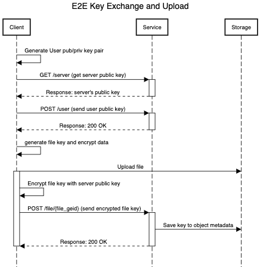

<!--
 Copyright 2022 Indoc Research
 
 Licensed under the EUPL, Version 1.2 or – as soon they
 will be approved by the European Commission - subsequent
 versions of the EUPL (the "Licence");
 You may not use this work except in compliance with the
 Licence.
 You may obtain a copy of the Licence at:
 
 https://joinup.ec.europa.eu/collection/eupl/eupl-text-eupl-12
 
 Unless required by applicable law or agreed to in
 writing, software distributed under the Licence is
 distributed on an "AS IS" basis,
 WITHOUT WARRANTIES OR CONDITIONS OF ANY KIND, either
 express or implied.
 See the Licence for the specific language governing
 permissions and limitations under the Licence.
 
-->

# service_encryption


## Development

Requirements:
- Python 3.7
- Virtualenv
- Docker 

To run locally:
```bash
virtualenv venv
source venv/bin/activate
pip install -r requirements
python app.py
```

To run with docker:
```bash
docker build . -q 
docker run <image_id_from_build>
```


## Design

Every file is encrypted with a random secret key generated at encryption/upload time.
The communication of this key is securely transferred using both client and server public key exchange. 


